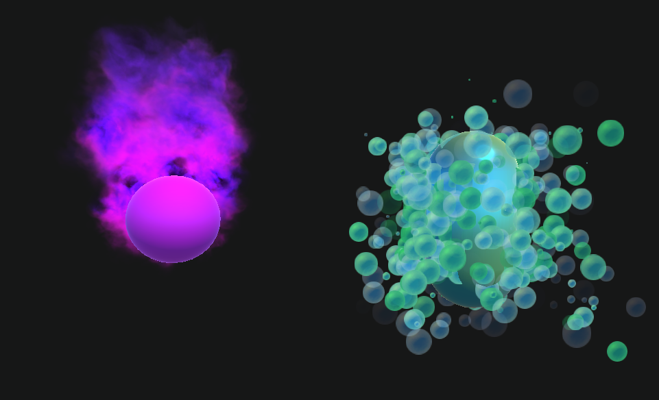

# VFXGraph-URP-Experiments
A couple really simple VFXgraphs in URP on 2019.3

**This is a personal experiment repo and not Unity Official**

Screenshot on Play: 

##References

- Brackeys, FIRE AND SMOKE with Unity VFX Graph! (HDRP) 
    - https://www.youtube.com/watch?v=R6D1b7zZHHA
- Sykoo, MAKING VISUAL EFFECTS IN UNITY 2018.3 | Beginner's Guide: VFX Graph
    - https://www.youtube.com/watch?v=spBn7Vjah5s&t
